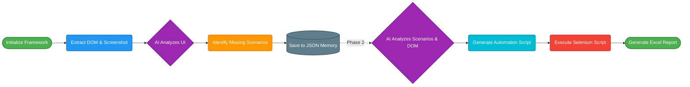

# Playwright Testing Framework with End-to-End automation (MVC Architecture)

A powerful AI-driven end-to-end automation testing framework that combines **Playwright** with cutting-edge AI models (Google Gemini, OpenAI, Anthropic Claude, and xAI Grok) to intelligently generate, execute, and analyze automated tests.

---

## 🎯 Overview

This project automates web application testing by leveraging AI capabilities to:
- 🧠 **Intelligently generate test cases** from application behavior
- 📸 **Analyze visual elements** using computer vision
- 🔄 **Execute automated tests natively** using Playwright
- 📊 **Generate comprehensive reports** in Excel format
- 🌐 **Support multi-browser testing** (Chromium, Firefox, WebKit)

**Perfect for:** Testing web applications, API endpoints, user authentication flows, and complex application workflows.

---

## ✨ Features

| Feature | Description |
|---------|-------------|
| 🤖 **AI-Powered Test Generation** | Automatically generates test cases using Gemini, OpenAI, Claude, and Grok |
| 🎬 **Browser Automation** | Selenium WebDriver integration for real browser testing |
| 🖼️ **Visual Analysis** | Screenshot analysis with AI vision capabilities |
| 🔄 **Smart Fallback Mechanism** | Optimized to try cheaper/faster models first, falling back to powerful ones |
| 📝 **Test Scenarios** | JSON-based scenario definitions for flexible test cases |
| 📊 **Report Generation** | Automated Excel reports with detailed test results |
| 🔐 **Environment Management** | Secure API key management via `.env` |
| 🌍 **Multi-Domain Support** | Test multiple applications/domains simultaneously |
| 🏗️ **MVC Architecture** | Clean, modular code separated into Models, Views, and Controllers |

---

## 🔄 Lifecycle of Project



---

## 📁 Project Structure (MVC)

The application has been refactored into a highly maintainable Model-View-Controller (Service) architecture:

```text
PWFramework/
├── 📂 E2E/                              # AI Orchestration & CLI Engine
│   ├── 📄 index.js                      # Main entry point for the AI generator
│   ├── 📄 .env                          # Environment variables (API keys)
│   └── 📂 src/                          # MVC Architecture for the AI Engine
│       ├── 📂 controllers/              # automation_controller.js
│       ├── 📂 services/                 # ai_service, browser_service, file_service
│       └── 📂 views/                    # CLI menu interface
│
├── 📂 pages/                            # AI-Generated Playwright Page Object Classes
├── 📂 verification/                     # AI-Generated Assertion/Verification Classes
├── 📂 tests/                            # AI-Generated Executable Playwright Spec Files
│
├── 📂 memory/                           # Extracted JSON test scenarios
├── 📂 layouts/                          # Captured HTML DOM & Screenshots
├── 📂 data/                             # Injected test data (validData.json)
├── 📂 utils/                            # Manual utility scripts (CommonMethods)
│
├── 📄 playwright.config.js              # Core Playwright configuration
├── 📄 package.json                      # Project dependencies & metadata
└── 📄 README.md                         # This file
```

---

## 📋 Prerequisites

Before you begin, ensure you have:

- **Node.js** (v14 or higher)
- **npm** (v6 or higher)
- **Git** (for version control)
- **API Keys** (You only need one, but having multiple enables fallbacks):
  - 🔑 Google Gemini API Key
  - 🔑 OpenAI API Key (ChatGPT)
  - 🔑 Anthropic API Key (Claude)
  - 🔑 Grok API Key (xAI)

---

## 💾 Installation

### 1️⃣ Clone the Repository
```bash
git clone https://github.com/viveksurti-dev/PWFramework.git
cd PWFramework
```

### 2️⃣ Install Dependencies
```bash
npm install
```

---

## ⚙️ Configuration

### 1️⃣ Create `.env` File

Create a `.env` file in the project root with your API credentials. You can provide multiple Gemini API keys separated by commas for automatic rate-limit rotation!

```env
# Google Gemini API (Comma separated for multiple keys)
GEMINI_API_KEY=key_1,key_2,key_3

# OpenAI API
OPENAI_API_KEY=your_openai_api_key_here

# Anthropic API
ANTHROPIC_API_KEY=your_anthropic_api_key_here

# Grok API
GROK_API_KEY=your_grok_api_key_here
```

---

## 🚀 Usage

### Start the Interactive Framework
Simply run the custom npm script to launch the AI Orchestration CLI:
```bash
npm run ai
```
*(Or run manually via `node E2E/index.js`)*

You will be presented with a menu where you can:
1. Extract UI & Automate all scenarios natively
2. Extract UI & Generate JSON scenarios only
3. Execute specific scenarios
4. Execute failed scenarios
5. Execute untested scenarios
6. Export scenarios to Excel
7. Generate an executable test script manually

---

## 🤖 Supported AI Models & Fallback Strategy

To optimize API token costs and speed, the `ai_service.js` automatically tries **cheapest and fastest models first**, only falling back to more expensive "heavyweight" models if the cheap ones fail or hit rate limits.

### ⚡ FAST & CHEAP (Optimized for Tokens)
1. `gpt-4o-mini` (OpenAI)
2. `gemini-2.5-flash` (Google)
3. `gemini-2.0-flash` (Google)
4. `gemini-1.5-flash` (Google)
5. `gpt-3.5-turbo` (OpenAI - Non-vision only)

### 🏋️ POWERFUL (Fallback Only)
6. `claude-3-5-sonnet-20241022` (Anthropic)
7. `gpt-4o` (OpenAI)
8. `grok-2-vision-1212` (xAI)

---

## 🤝 Contributing

Contributions are welcome! Please:

1. Fork the repository
2. Create a feature branch (`git checkout -b feature/improvement`)
3. Commit changes (`git commit -am 'Add improvement'`)
4. Push to branch (`git push origin feature/improvement`)
5. Open a Pull Request

---

## 📜 Changelog

### v1.3.0 - Current
- **Strict 3-Tier POM Architecture**: Re-architected the AI framework to generate code that strictly adheres to the manual 3-Tier Page Object Model (BasePage, Verification Class, and Page Class) without relying on custom fixtures or TypeScript syntax.
- **Playwright Windows Path Execution Fix**: Solved an issue where absolute paths with spaces and backslashes would crash Playwright's regex matcher natively on Windows; the automated controller now passes relative paths for perfect execution stability.
- **Resilient AI Payloads**: Built robust parsers to handle AI double-escaped newlines and token truncation limits, effectively stopping "SyntaxError" crashes and blank test files.
- **Smarter Negative Assertions**: Directed the AI to test functionality over exact strings—verifying that error elements are visible rather than enforcing strict string matching for dynamic UI validation.

### v1.2.0
- **Directory Structure Alignment**: Completely restructured the project so all AI-generated files naturally sit in the root `tests/`, `pages/`, and `verification/` folders, resolving all relative import pathing errors between the AI and manual codebases.
- **Major Logic Fixes**: Cleaned up the AI's fallback loops, added dynamic waiting, and implemented comprehensive error-catching mechanisms so the automation flow survives unpredicted crashes.
- **Manual Execution Prompts**: Pushed AI prompts into console logs, allowing the user to copy/paste the prompt into a manual browser window to bypass rate-limits and safely inject code back into the local framework.

### v1.1.0
- **AI Integration Core**: Successfully hooked up advanced Generative AI models (Gemini, Claude, GPT, Grok) into the Playwright framework to dynamically evaluate the DOM and autonomously write full E2E scripts.
- **Automated Memory Generation**: Implemented the JSON scenario extractor to build persistent memories of test permutations locally.

### v1.0.0
- **PWFrameworkXE2E**: Initial monolithic foundation. Established the core framework for Playwright execution and manual POM architecture before AI integration.

---

## 📄 License

This project is licensed under the **ISC License**.
